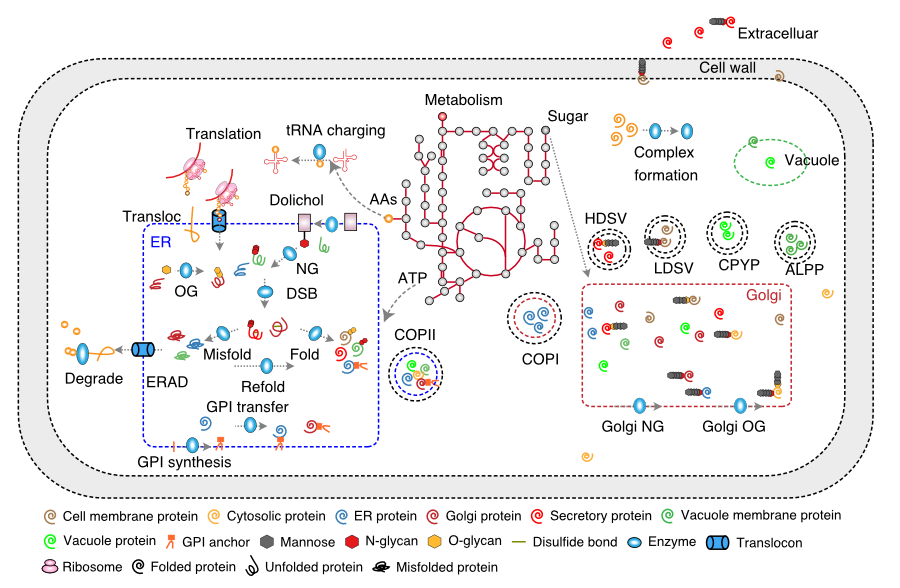

# pcSecYeast: The proteome constrained genome scale secretory model of _Saccharomyces cerevisiae_

  

* Brief Model Description:

This repository contains the current consensus proteome constrained genome scale secretory model of _Saccharomyces cerevisiae_, which expands the metabolic model with protein translation, post-translational modifiaction and secretion process.

* Model KeyWords:

**GEM Category:** species; **Utilisation:** experimental data reconstruction, multi-omics integrative analysis, _in silico_ strain design; **Field:** metabolic-network reconstruction; **Type of Model:** reconstruction, curated; **Taxonomy:** _Saccharomyces cerevisiae_; 

* Last update: 2021-07-20

* Main Model Descriptors:

|Taxonomy | Template Model |
|:-------:|:--------------:|
|_Saccharomyces cerevisiae_|[Yeast 8.3.5](https://github.com/SysBioChalmers/yeast-GEM/blob/master/ModelFiles/xml/yeastGEM.xml)

This repository is administered by Feiran Li ([@feiranl](https://github.com/feiranl)), Division of Systems and Synthetic Biology, Department of Biology and Biological Engineering, Chalmers University of Technology.

## Citation

- Currently, please cite the preprint paper "[Genome scale modeling of the protein secretory pathway reveals novel targets for improved recombinant protein production in yeast](https://doi.org/10.1101/2021.10.16.464630)"

## Installation

### Required Software - User:

* Matlab user:
  * A functional Matlab installation (MATLAB 7.3 or higher).
  * The [COBRA toolbox for MATLAB](https://github.com/opencobra/cobratoolbox).
  * solver [SoPlex](https://soplex.zib.de).

## Usage

For generate the figures in this paper, please download the intemediate file from the [Zenode](https://zenodo.org/record/6320643), and run the correponding function in [ComplementaryScripts/Simulation](https://github.com/SysBioChalmers/pcSecYeast/tree/main/ComplementaryScripts/Simulation)
For generatre the pcSecYeast model, run [buildModel](https://github.com/SysBioChalmers/pcSecYeast/tree/main/ComplementaryScripts).

## Manual

This manual describes how the data were collected, how the model was reconstructed, and how the optimization problem was generated.

## Main collected information
[TableS1.xlsx](https://github.com/SysBioChalmers/pcSecYeast/blob/main/ComplementaryData/TableS1.xlsx)
contains all collected information.
 * Annotation & Annotation_extra: gene names and sequence information of all S. cerevisiae proteins.
 * Machinery: proteins which makes ribosome, ribosome assembly complex and proteasome complex
 * Secretory: proteins which makes secretory machinery complexes
 * Secretory_ref: references for how those secretory complexes are summarized
 * kdeg: kdeg information collected from reference ([PMID: 33176155](https://pubmed.ncbi.nlm.nih.gov/33176155/))
 * kcat_info_metabolic: kcat values used in the metabolic part
 * kcat_info_sectory: kcat values used in the secretory part
 * kcat_info_machinery: kcat values used in the ribosome, ribosome assembly and proteasome

[Protein_information.xlsx](https://github.com/SysBioChalmers/pcSecYeast/blob/main/ComplementaryData/Protein_Information.xlsx)
Contains the Protein Specific Information Matrix (PSIM) data for all proteins in S. cerevisiae, including whether the protein is processed by secretory pathway, the existence of the signal peptide, number of disulfide bond sites, N-glycosylation sites, O-glycosylation sites, transmembrane domains, GPI sites, protein localization, protein amino acid sequence and signal peptide sequence. The PSIM data were collected from literature3 and UniPort database4.

